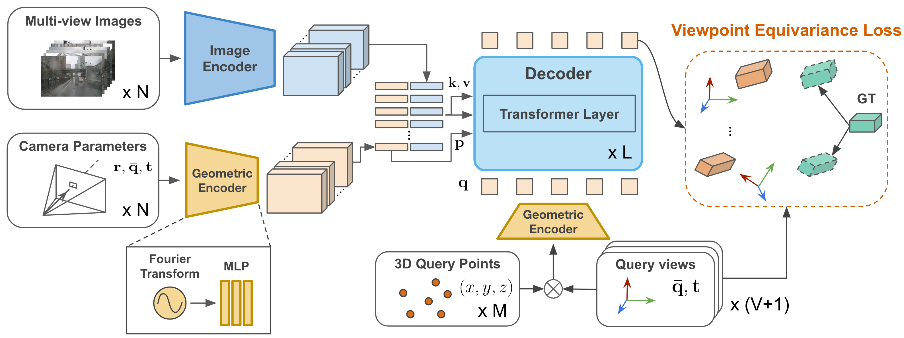

<!-- omit in toc -->
# VEDet: Viewpoint Equivariance for Multi-View 3D Object Detection (CVPR 2023)

This is the official implementation of CVPR 2023 paper [**Viewpoint Equivariance for Multi-View 3D Object Detection**](https://arxiv.org/abs/2303.14548) authored by [Dian Chen](https://scholar.google.com/citations?user=zdAyna8AAAAJ&hl=en), [Jie Li](https://scholar.google.com/citations?user=_I3COxAAAAAJ&hl=en), [Vitor Guizilini](https://scholar.google.com/citations?user=UH9tP6QAAAAJ&hl=en), [Rares Ambrus](https://scholar.google.com/citations?user=2xjjS3oAAAAJ&hl=en), and [Adrien Gaidon](https://scholar.google.com/citations?user=2StUgf4AAAAJ&hl=en), at [Toyota Research Institute](https://www.tri.global/). We introduce viewpoint equivariance on view-conditioned object queries achieving state-of-the-art 3D object performance.


 - [May 4, 2023] Our code and models are released!
 - [Mar. 27, 2023] ~~Our code and models will be released soon. Please stay tuned!~~

<!-- omit in toc -->
## Contents
- [Install](#install)
- [Dataset preparation](#dataset-preparation)
- [Training](#training)
- [Inference](#inference)
- [License](#license)
- [Reference](#reference)


## Install

We provide instructions for using docker environment and pip/conda environment (docker is recommended for portability and reproducibility). Please refer to [INSTALL.md](docs/INSTALL.md) for detailed instructions.

## Dataset preparation
Please download the full [NuScenes dataset from the official website](https://www.nuscenes.org/nuscenes#download), and preprocess the meta data following the [instructions from MMDetection3D](https://github.com/open-mmlab/mmdetection3d/blob/master/docs/en/data_preparation.md) to obtain the `.pkl` files with mmdet3d format. For convenience we provide the preprocessed `.pkl` files for nuscenes dataset [here](https://tri-ml-public.s3.amazonaws.com/github/vedet/nuscenes_infos.zip). Put the `.pkl` files under the NuScenes folder.

## Training
To train a model with the provided configs, please run the following:
```bash
# run distributed training with 8 GPUs
# tools/dist_train.sh <config path> 8 --work-dir <save dir> --cfg-options <overrides>

# for example:
tools/dist_train.sh projects/configs/vedet_vovnet_p4_1600x640_2vview_2frame.py 8 --work-dir work_dirs/vedet_vovnet_p4_1600x640_2vview_2frame/
```
Before running the training with V2-99 backbone, please download the [DD3D](https://arxiv.org/abs/2108.06417) pre-trained weights from [here](https://tri-ml-public.s3.amazonaws.com/github/vedet/fcos3d_vovnet_imgbackbone-remapped.pth).

We provide results on the NuScenes `val` set from the paper, as summarized below.

| config | mAP | NDS | resolution | backbone | context | download |
|:------:|:---:|:---:|:----------:|:-------:|:-----:|:-----:|
|  [vedet_vovnet_p4_1600x640_2vview_2frame](projects/configs/vedet_vovnet_p4_1600x640_2vview_2frame.py)  | 0.451 | 0.527  | 1600x640 | V2-99 |  current + 1 past frame  |  [model](https://tri-ml-public.s3.amazonaws.com/github/vedet/vedet_vovnet_p4_1600x640_2vview_2frame/latest.pth) / [log](https://tri-ml-public.s3.amazonaws.com/github/vedet/vedet_vovnet_p4_1600x640_2vview_2frame/20230130_000443.log)   |


## Inference
To run inference with a checkpoint, please run the following:
```bash
# run distributed evaluation with 8 GPUs
# tools/dist_test.sh <config path> <ckpt path> 8 --eval bbox

# for example:
tools/dist_test.sh projects/configs/vedet_vovnet_p4_1600x640_2vview_2frame.py work_dirs/vedet_vovnet_p4_1600x640_2vview_2frame/latest.pth 8 --eval bbox
```

## License
We release this repo under the [CC BY-NC 4.0](LICENSE.md) license.

## Reference
If you have any questions, feel free to open an issue under this repo, or contact us at <dian.chen@tri.global>.
If you find this work helpful to your research, please consider citing us:

```
@article{chen2023viewpoint,
  title={Viewpoint Equivariance for Multi-View 3D Object Detection},
  author={Chen, Dian and Li, Jie and Guizilini, Vitor and Ambrus, Rares and Gaidon, Adrien},
  journal={arXiv preprint arXiv:2303.14548},
  year={2023}
}
```
We also thank the authors of [detr3d](https://github.com/WangYueFt/detr3d) and [petr/petrv2](https://github.com/megvii-research/PETR).
